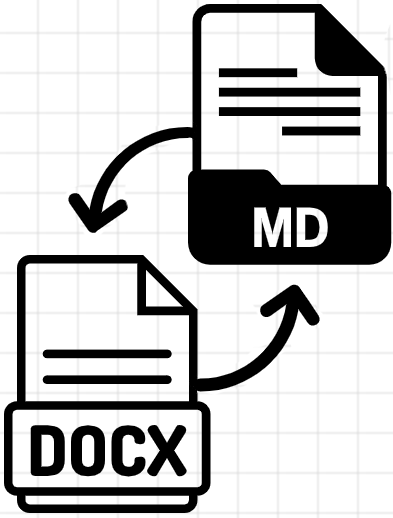
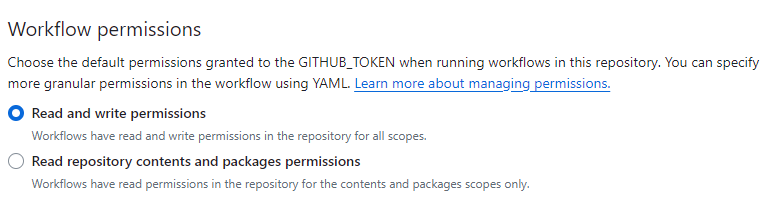

# DOC-to-Markdown & Markdown to DOCX Converter

Automatic conversion between DOCX/DOC and Markdown formats.

### Workflows

### 1. Convert DOCX/DOC Files to Markdown

This workflow is triggered whenever a DOCX or DOC file is pushed to the
repository. It converts all DOCX and DOC files (case-insensitive) to
Markdown format (`.md`).

-   **Trigger:** Push events for `.docx`, `.DOCX`, `.doc`, and `.DOC`
    files.
-   **Manual Trigger:** You can also trigger the workflow manually via
    the GitHub Actions tab.
-   **Output:** Corresponding Markdown files (`.md`) for each DOCX/DOC
    file.

### 2. Convert Markdown Files to DOCX/DOC

This workflow is triggered whenever a Markdown (`.md`) file is pushed to
the repository. It converts all Markdown files (except `LICENSE.md`) to
both DOCX and DOC formats.

-   **Trigger:** Push events for `.md` files.
-   **Manual Trigger:** You can also trigger the workflow manually via
    the GitHub Actions tab.
-   **Output:** Corresponding DOCX (`.docx`) and DOC (`.doc`) files for
    each Markdown file.

## Setup: Enable Github Action Permissions

Go to Settings \> Actions \> General \> Workflow Permissions - Make sure
Read and write permissions are enabled

## Usage

1.  **Automatic Conversion:**
    -   The workflows automatically run on push events for the specified
        file types.
    -   Simply push a DOCX/DOC or Markdown file to the repository, and
        the corresponding files will be converted.
2.  **Manual Trigger:**
    -   You can manually trigger the conversion workflows from the
        "Actions" tab in your repository. Select the workflow you want
        to run and click "Run workflow."

## Notes
-   The `LICENSE.md` file is excluded from conversion

----------
#### Disclaimer
This repository is a scientific product and is not official communication of the National Oceanic and Atmospheric Administration, or the United States Department of Commerce. All NOAA GitHub project content is provided on an ‘as is’ basis and the user assumes responsibility for its use. Any claims against the Department of Commerce or Department of Commerce bureaus stemming from the use of this GitHub project will be governed by all applicable Federal law. Any reference to specific commercial products, processes, or services by service mark, trademark, manufacturer, or otherwise, does not constitute or imply their endorsement, recommendation or favoring by the Department of Commerce. The Department of Commerce seal and logo, or the seal and logo of a DOC bureau, shall not be used in any manner to imply endorsement of any commercial product or activity by DOC or the United States Government.

##### License
See the [LICENSE.md](./LICENSE.md) for details
